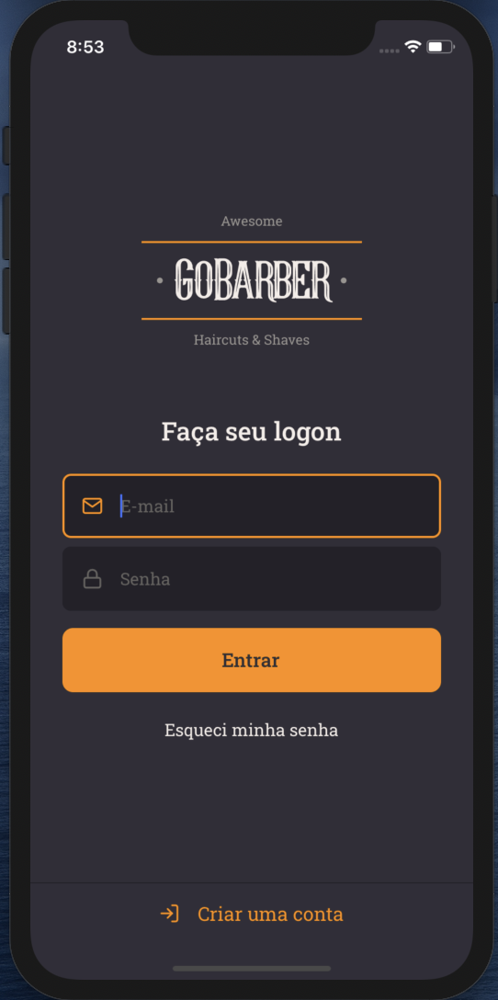

<h1 align="center">
GoBarberApp
</h1>

  

App do projeto GoBarber

## Bibliotecas e linguagens

- [x] TypeScript
- [x] React.js
- [x] React Native
- [x] React Navigation
- [x] Styled Components
- [x] Yup
- [x] Unform
- [x] Axios

## Inicio do Build do APP
1. Faça o clone desse repositório e acesse a pasta.
2. Abra o Simulador (ios) ou algum emulador android (android)
3. Execute `yarn android` ou `yarn ios`. 

## Agradecimento
Time da Rocketseat.